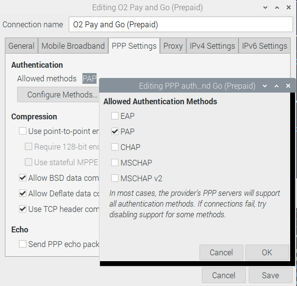

# HL7692 Pilot
==============

The aim is to configure the Raspberry Pi Raspian OS and the HL7692 to use the USB MBIM 
protocol to enable cellular communications between the Raspberry PI and the HL7692


## HL7692 module AT command configuration
=========================================

With network manager and associated helpers disabled it is possible to manually
 command / configure the HL7692 via it's USB serial port  

With network manager manger running it's better to use the physical UART connection between
 the RPi and the Pilot / HL7692. This works ok on the RPi's that don't have WiFi or the RPi4.

To access the HL7692 USB serial port command interface use a serial
 terminal tool like minicom 

```
$ sudo minicom -D /dev/ttyACM0
```

To access the physical serial port use something like this (look on line on how to
 enable the physical serial port) - this was used on the RPi4

```
$ sudo minicom -b 115200  -D /dev/ttyS0
```

### LEDs
Note that the LED port configuration is erased if the modem firmware is updated

The Pilot board recommended settings are as follows - the modem should be preconfigured
 like this when the Pilot board is new

#### LED D6
Set LED D6 as cellular network status indicator with the following command
```
at+ksync=2,7
```

With this setting the LED D6 behaviour is as follows

1. LED PERMANENTLY OFF: Not registered / Initialization / Registration denied / no SIM card
1. LED 600 ms ON / 600ms OFF: Not registered but searching 
1. LED 75 ms ON / 3s OFF: connected to the network

#### LED D5
Set LED D5 as the cellular Pilot module boot and power indicator  
```
at+kgpio=8,1
```

With this setting the LED D5 behaviour is as follows
1. If the modem is off then the LED will be OFF
1. Following modem powered off - if a power on signal is applied to the Pilot module 
the LED should momentarily flash on
1. Then the LED will be OFF
1. After the modem has booted the LED should be ON

### HL7692 USB port composition

Currently network manager effectively manages the HL7692 network interface 
if the HL7692 is reconfigured to USB composition 2 which gives 1 MBIM and 1 USB port.
This a change from the modules default setting 

At this time (August 2019) the Sierra AT command guide indicated that three USB serial ports 
will be made available but this wasn't the case with the available FW RHL769x.2.26 and RHL769x.2.27.

Configure the composition
```
AT+KUSBCOMP=2
```

Check the composition
```
AT+KUSBCOMP?
+KUSBCOMP: 2
```

## HL7692 and power on signal
=============================

Recommend using the power ON / OFF scripts to ensure correct state of modem operation - this will 
overide the RPi's GPIO default state which may not be a stable signal.

| RPi    |  HL7692 power up state                             |
| ------ | -------------------------------------------------- |
| RPi3B+ | Default GPIO state causes Pilot to power up        |
| RPi4   | Default GPIO state causes Pilot to be powered down |


## O2 network and PAP authentication
====================================

Many networks appear to work without PAP or CHAP authentication.
 O2 requires PAP authentication - we tested using a PAYG SIM  

On O2 the modem also often connected to 2G edge - to workaround this during testing
 we locked the modem to LTE only

### Rpi Rasbian
* Lock the modem to LTE by using AT command AT+KSRAT=5 
* Manually configure the modems context 1 using AT command
 AT+CGDCONT = 1,"IP","payandgo.o2.co.uk",,,
* Use the Network manager GUI to configure network manager as follows - note that APN and Number are
 blank and that only PAP authentication is selected 


  

Note that the PPP setting is picked up by network manager and used via the MBIM interface
 not an actual PPP session

[Read back settings via the networkmanager CLI](./example_nmcli_configRead_O2_HL7692.md)


## Vodafone PAYG

AT+CGDCONT = 1,"IP","pp.vodafone.co.uk",,,
AT+CGDCONT = 2,"IP","pp.vodafone.co.uk",,,

Then set up  
Username wap  
Password wap

AT+KSRAT=9 

Then as per O2 above. This works but only gives a 2G EDGE connection


## Debugging notes
==================

Using the physical serial port between the Pi and Pilot - note that this can be tricky t

Check radio access technology
```
AT+KSRAT?
9 == LTE first then GSM
5 == LTE Only
```

```
AT+CGDCONT= 1,"IPV4V6","payandgo.o2.co.uk",,,  

```


### Windows
I also tested the HL7692 Pilot on a Windows 10 machine 

On the windows machine to get the HL7692 to work I had to 
* Lock the modem to LTE - AT+KSRAT=5 
* Manually set the apn, username and password using the windows cellular GUI
* Manually configure the modems context 1 by using AT command
 AT+CGDCONT = 1,"IP","payandgo.o2.co.uk",,, 

## debugging aids
=================

Using
``` 
nmcli monitor
```
Successful connection OP capture
```
O2 Pay and Go (Prepaid): connection profile changed
cdc-wdm0: using connection 'O2 Pay and Go (Prepaid)'
cdc-wdm0: connecting (prepare)
Networkmanager is now in the 'connecting' state
cdc-wdm0: connecting (need authentication)
cdc-wdm0: connecting (prepare)
cdc-wdm0: connecting (configuring)
cdc-wdm0: connecting (getting IP configuration)
cdc-wdm0: connecting (checking IP connectivity)
cdc-wdm0: connecting (starting secondary connections)
cdc-wdm0: connected
Networkmanager is now in the 'connected (local only)' state
Networkmanager is now in the 'connected (site only)' state
'O2 Pay and Go (Prepaid)' is now the primary connection
Networkmanager is now in the 'connected' state
Connectivity is now 'full'

