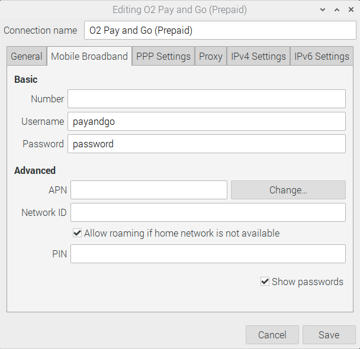
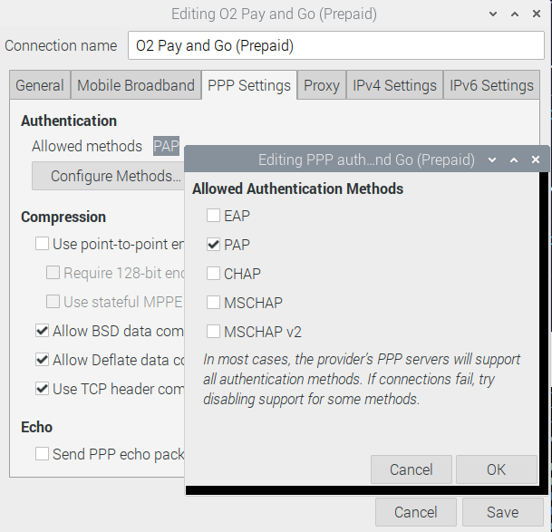

## Network manager GUI V cellular SIM examples    
We'll add to the examples as and when we test SIMs  
So far the following have worked ok  

* PAYG EE
* PAYG O2
* PAYG Vodafone
* PAYG Three

## O2 PAYG SIM 

Many networks appear to work without PAP or CHAP authentication.
 O2 requires PAP authentication - we tested using a PAYG SIM  

On O2 the network seemed to prefer a connection to 2G edge - to workaround this during testing
 we locked the modem to 4g / LTE only

**Configuring NetworkManager**

* Lock the modem to 4G / LTE by using AT command AT+KSRAT=5 
* Manually configure the modems context 1 using AT command
  AT+CGDCONT = 1,"IP","payandgo.o2.co.uk",,,  
  We think this may be necessary because network manager losses track of the
   modems AT+CGDCONT setting but this could be incorrect 
* Use the NetworkManager Applet (GUI) to configure network manager

The following is an example of using the NetworkManager Applet to configure 
 an O2 connection  

Note that APN and Number are blank and that only PAP authentication is selected 



  

Note that the PPP setting is picked up by network manager and used via the MBIM interface
 not an actual PPP session

[Read back settings via the networkmanager CLI](./example_nmcli_configRead_O2_HL7692.md)
  

## Vodafone PAYG

Notes from using a new PAYG SIM  
1. When purchased the SIM is not activated on the network
1. To activate the SIM add credit 
1. After activation the SIM will enable cellular devices to connect on 3G / 2G
1. The HL7692 does not support 3G - to work around this we enabled 2G on the HL7692
1. To enable 4G the following steps were carried out.  
   1. Added a £10 big bundle 
   1. Created a Vodafone online account
   1. Added the SIM phone number to the online account 


Then set up via NetworkManager Applet as per O2 above.

Note that after initial configuration clearing the apn setting from the NetworkManager Applet
 (right click -> edit connections) appears to be necessary for normal operation of NetworkManager
 
| **Value**          | **Setting**        |
|:------------------ |:------------------ |
| apn    	           | pp.vodafone.co.uk  |
| username 	         | wap                |
| password 	         | wap                |
| Authentication     | PAP                |


It's possible that NetworkManager Applet silently fails to set the modules apn - 
if NetworkManager fails to connect check the modems setting by using serial AT command 
```
AT+CGDCONT? 
```
to check the modules internal apn setting - if it's not correct use something like the
 following to correct it

```
AT+CGDCONT = 1,"IP","pp.vodafone.co.uk",,,
AT+CGDCONT = 2,"IP","pp.vodafone.co.uk",,,
```

